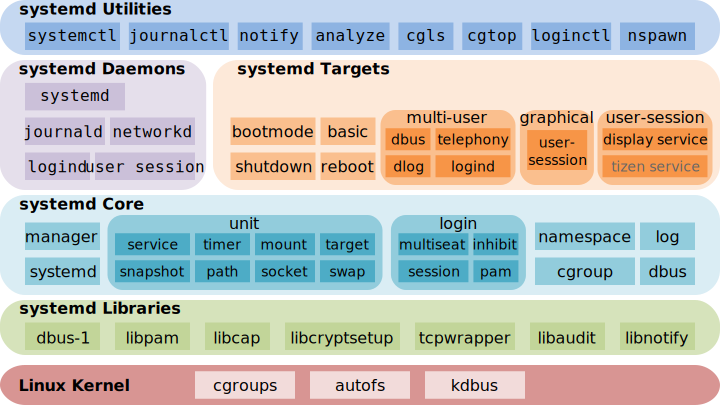

= Linux
:icons:
:toc:
:numbered:
:toclevels: 4
:source-highlighter: highlightjs
:highlightjsdir: highlight
:highlightjs-theme: monokai

:source-language: bash

.部分内容参考了：
- 《鸟哥的Linux私房菜 基础学习篇（第四版）》
- http://www.ruanyifeng.com/blog[阮一峰的网络日志]

如有侵权，请在 GitHub 联络 j0k3rk 删除。

== 常用命令

命令格式

----
命令 选项 参数
----
- 个别命令不遵循此格式
- 有多个选项时，可以写在一起
- 简化选项和完整选项
    * -a 等于 --all

=== bzip2

[source]
----
# 压缩为.bz2格式，不保留源文件
bzip2 源文件

# 压缩之后保留源文件
bzip2 -k 源文件

# 解压缩，-k保留压缩文件（2种方法）
bzip2 -d 压缩文件
bunzip2 压缩文件
----

[NOTE]
====
bzip2 命令不能压缩目录
====

=== cd

变更目录

[source]
----
cd 目录

cd ~    # 进入当前用户的home目录
cd -    # 进入上次目录
cd ..   # 进入上一级目录
cd .    # 进入当前目录
----

=== cp

复制文件或目录

[source]
----
cp 选项 原文件或目录 目标目录
----

. -a   相当于 -dpr
. -d   若源文件是链接文件，则复制链接属性
. -p   连带文件属性复制
. -r   复制目录

=== find

搜索文件

[source]
----
find 搜索范围 搜索条件
----

. 避免大范围搜索，会非常耗费系统资源
. find 是在系统当中搜索符合条件的文件名。如果需要匹配，使用通配符匹配，通配符是完全匹配。

. 示例
+
[source, bash, numbered]
----
# 使用通配符
#   *  匹配任意内容
#   ?  匹配任意一个字符
#   [] 匹配任意一个中括号内的字符
find /root -name "install.log*"

# 不区分大小写
find /root -iname install.log

# 按照所有者搜索
find /root -user root

# 查找没有所有者的文件
# 一般情况下，没有所有者的文件即为垃圾文件，但有两个例外：
# （1）Linux内核直接产生，例如内存交换目录中的文件；
# （2）外部产生的文件，例如Windows系统中创建的文件，通过U盘拷贝到Linux系统中。
find /root -nouser

# 查找10天前修改的文件
find /var/log/ -mtime +10

    #   atime   文件访问时间
    #   ctime   改变文件属性
    #   mtime   修改文件内容

    #   -10 10天内修改的文件
    #    10 10天当天修改的文件
    #   +10 10天前修改的文件

# 查找文件大小是25KB的文件
find . -size 25k

    #   -25k    小于25KB的文件
    #    25k    等于25KB的文件
    #   +25k    大于25KB的文件
    #   注意：输入单位时，k 必须小写，M 必须大写。

# 查找 i 节点是262422的文件
find . -inum 262422

# 查找/etc/目录下，大于20KB且小于50KB的文件
find /etc -size +20k -a -size -50k
    #   -a  and 逻辑与
    #   -o  or  逻辑或

# 查找/etc/目录下，大于20KB且小于50KB的文件，并显示详细信息
# -exec/-ok 命令 {} \;  对搜索结果执行操作
find /etc -size +20k -a -size -50k -exec ls -lh {} \;
----

=== grep

在文件当中匹配符合条件的字符串，使用正则表达式进行匹配，匹配方式为包含匹配。

[source]
----
grep 选项 字符串 文件名
----

. -i   忽略大小写
. -v   排除指定字符串

=== gzip

.gz格式压缩

[source]
----
# 压缩为.gz格式的压缩文件，源文件会消失
gzip 源文件

# 压缩为.gz格式，源文件保留
gzip -c 源文件 > 压缩文件

# 压缩目录下所有的子文件，但是不能压缩目录
gzip -r 目录

# 解压缩文件（2种方法）
gzip -d 压缩文件
gunzip 压缩文件
----

=== info

详细命令帮助

[source]
----
info 命令
----

. -回车：进入子帮助页面（带有*号标记）
. -u  ：进入上层页面
. -n  ：进入下一个帮助小节
. -p  ：进入上一个帮助小节
. -q  ：退出

=== kill

杀死进程

[NOTE]
.参照 ps 命令，进程主要有5种状态:
====
. D：不可被唤醒的睡眠状态，uninterruptible sleep (usually IO)
. R（Running）：运行中，running or runnable (on run queue)
. S（Sleep）：正在睡眠但可以被唤醒，interruptible sleep (waiting for an event to complete)
. T（sTop）：停止状态，stopped by job control signal
. Z（Zombie）：僵尸状态，进程已经终止，defunct ("zombie") process, terminated but not reaped by its parent
====

=== last

查询当前登录和过去登录的用户信息。

. last命令默认读取/var/log/wtmp文件数据。

. 命令输出：
.. 用户名
.. 登录终端
.. 登录IP
.. 登录时间
.. 退出时间（在线时间）

=== lastlog

查看所有用户的最后一次登录时间。

. lastlog命令默认读取/var/log/lastlog文件内容

. 命令输出
.. 用户名
.. 登录终端
.. 登录IP
.. 最后一次登录时间

=== ll

相当于 ls -l

=== ln

生成链接文件

[source]
----
ln -s 原文件 目标文件
----

. -s   创建软链接

=== locate

在后台数据库中按文件名搜索（比find速度快）

[source]
----
locate 文件名
----

. locate命令所搜索的后台数据库：/var/lib/mlocate （不同的Linux发行版，数据库名称可能有差别）。
. 该数据库并非实时更新，刚创建的文件可能搜不到，此时可用命令 updatedb 先更新数据库再搜索。

. locate的搜索行为由配置文件 /etc/updatedb.conf 定义：
+
[source]
----
# 开启搜索限制
PRUNE_BIND_MOUNTS = "yes"

# 搜索时，不搜索的文件系统
PRUNEFS =

# 搜索时，不搜索的文件类型
PRUNENAMES =

# 搜索时，不搜索的路径
PRUNEPATHS =
----

=== logout

退出登录

=== ls

列出文件或目录

[source]
----
ls 选项 文件或目录
----

. -a  显示所有文件，包含隐藏文件
. -d  查看目录属性
. -h  人性化显示文件大小
. -i  显示inode

. -l  显示详细信息
+
[source, shell]
----
[root@localhost ~]# ls
anaconda-ks.cfg
[root@localhost ~]# ls -l
总用量 4
-rw-------. 1 root root 1326 5月   9 07:27 anaconda-ks.cfg
----
+
[NOTE]
====
. 一共10位
. 第1位的“-”：表示文件类型（-文件，d目录，l软链接文件）
. 后9位分3组，每3位为1组，分别代表：u所有者，g所属组，o其他人 （权限表示为：r读，w写，x执行）
====

=== man

查看帮助

[source]
----
man 命令
----

. man的级别
+
[source]
----
#1   查看命令的帮助
#2   查看可被内核调用的函数的帮助
#3   查看函数和函数库的帮助
#4   查看特殊文件的帮助（主要是/dev目录下的文件）
#5   查看配置文件的帮助
#6   查看游戏的帮助
#7   查看其它杂项的帮助
#8   查看系统管理员可用命令的帮助
#9   查看和内核相关文件的帮助
----

. 查看命令拥有那个级别的帮助
+
[source]
----
man -f 命令
# 相当于
whatis 命令

man -5 passwd
man -8 ifconfig
----

. 查看和命令相关的所有帮助
+
[source]
----
man -k 命令
# 相当于
apropos 命令
----

. 选项帮助
+
[source]
----
命令 --help

ls --help
----

. shell内部命令帮助
+
[source]
----
help shell内部命令

whereis cd  # 确定是否是shell内部命令。如果只能找到帮助、找不到可执行文件，说明是内部命令。
help cd     # 获取内部命令帮助
----

=== mkdir

创建目录

[source]
----
mkdir 单级目录
mkdir -p 多级目录
----

=== mount

挂载

[source]
----
# 格式
mount [-t 文件系统] [-o 特殊选项] 设备文件名 挂载点

# 查询系统中已经挂载的设备
mount

# 依据配置文件/etc/fstab的内容，自动挂载
mount -a
----

. -t 文件系统：加入文件系统类型来指定挂载的类型，ext3、ext4、iso9660等

. -o 特殊选项：可以指定挂载的额外选项

.. atime/noatime
+
访问分区文件时，是否更新文件的访问时间，默认为更新。

.. async/sync
+
默认为异步。

.. auto/noauto
+
mount -a 命令执行时，是否自动安装/etc/fstab文件内容挂载，默认为自动。

.. defaults
+
定义默认值，相当于rw、suid、dev、exec、auto、nouser、async这七个选项。

.. exec/noexec
+
设定是否允许在文件系统中执行可执行文件，默认是exec允许。

.. remount
+
重新挂载已挂载的文件系统，一般用于指定修改特殊权限。

.. rw/ro
+
文件系统挂载时，是否具有读写权限，默认是rw。

.. suid/nosuid
+
设定文件系统是否具有SUID和SGID的权限，默认是具有。

.. user/nouser
+
设定文件系统是否允许普通用户挂载，默认是不允许，只有root可以挂载分区。

.. usrquota
+
写入代表文件系统支持用户磁盘配额，默认不支持。

.. grpquota
+
写入代表文件系统支持组磁盘配额，默认不支持。

. 挂载光盘
+
[source]
----
# 建立挂载点
mkdir /mnt/cdrom/

# 挂载光盘（2种方法）
mount /dev/sr0 /mnt/cdrom/
mount -t iso9660 /dev/cdrom /mnt/cdrom/

# (卸载)。如果当前工作目录就是光盘目录，需要先退出光盘目录，才能正常卸载。
umount /mnt/cdrom/
----

. 挂载U盘
+
[source]
----
# 查看U盘设备文件名
fdisk -l

# 假设只有一块硬盘sda，则挂载U盘为sdb。vfat即fat32格式。
mount -t vfat /dev/sdb1 /mnt/usb/
----
+
[NOTE]
====
Linux默认不支持NTFS文件系统，解决办法（只读、不能写入）：

- 重新编译内核
- 下载NTFS-3G
====

=== mv

剪切或改名

[source]
----
mv 原文件或目录 目标目录
----

=== ping

. 指定次数为4次，数据包大小为 32767 Bytes：
+
[source]
----
ping -c 4 -s 32767 ip
----

. Windows下，指定次数为6次，ping包大小为 1500 Bytes：
+
[source]
----
ping -n 6 -l 1500 ip
----

=== pwd

（打印）查询工作目录

=== rm

删除文件或目录

. -r 表示递归（即包含子目录）
. -f 表示强制
+
[source]
----
rm -rf  # 强制删除目录下所有的东西
----

=== rmdir

删除空目录

=== runlevel

查询系统运行级别

=== shutdown

[source]
----
shutdown 选项 时间
----

. -c ：取消前一个关机命令
. -h ：关机
. -r ：重启

[TIP]
====
. 其他关机命令：
.. halt
.. poweroff
.. init 0

. 其他重启命令：
.. reboot
.. init 6

. init参数的含义（即系统运行级别）：
.. 0 关机
.. 1 单用户
.. 2 不完全多用户，不含NFS服务
.. 3 完全多用户
.. 4 未分配
.. 5 图形界面
.. 6 重启
====

=== tar

[source]
----
# 打包
tar -cvf 打包文件名 源文件

# 解包
tar -xvf 打包文件名

# 打包且压缩
tar -zcvf 压缩包名.tar.gz 源文件
tar -jcvf 压缩包名.tar.bz2 源文件

# 解压缩且解包
tar -zxvf 压缩包名.tar.gz
tar -jxvf 压缩包名.tar.bz2
tar -xvJf 压缩包名.tar.xz   # 注意J大写

# 测试
tar -ztvf 压缩包名.tar.gz
----

. -c ：打包
. -v ：显示过程
. -f ：指定打包后的文件名
. -x ：解包
. -z ：压缩为.tar.gz格式
. -j ：压缩为.tar.bz2格式
. -J ：压缩为.tar.xz格式
. -t ：测试（查看压缩包中的内容，不实际解压）

=== timedatectl

日期/时间/时区 设置

[source]
----
# 查看当前设定
timedatectl

# 列出时区
timedatectl list-timezones

# 变更时区
timedatectl set-timezone Asia/Shanghai
----

=== touch

创建文件或修改文件时间

=== unzip

解压缩文件

[source]
----
unzip 压缩文件
----

=== w

查看登录用户信息。

命令输出：

. user: 登录的用户名
. tty: 登录终端
. from: 从哪个IP登录
. login@: 登录时间
. idle: 用户闲置时间
. jcpu: 指的是和该终端连接的所有进程占用的时间。这个时间里不包括过去的后台作业时间，但包括当前正在运行的后台作业所占用的时间。
. pcpu: 指当前进程所占用的时间
. what: 当前正在运行的命令

=== whereis

搜索命令所在路径及帮助文档所在位置

[source]
----
whereis 命令名
----

. -b   只查找可执行文件
. -m   只查找帮助文件

=== which

搜索命令所在路径及别名

=== who

查看登录用户信息。

命令输出：

. 用户名
. 登录终端
. 登录时间（登录来源IP）

=== xz

*.tar.xz 文件的压缩率比 *.tar.gz 更高，用法如下：

. 压缩
+
[source]
----
# 将 *.tar.gz 压缩为 *.tar.xz
xz -z 要压缩的文件
----
+
如果要保留被压缩的文件，追加参数 -k 。   +
如果要设置压缩率，加入参数 -0 到 -9 调节压缩率。默认压缩等级为 6 。

. 解压
+
[source]
----
# 将 *.tar.xz 解压为 *.tar.gz
xz -d 要解压的文件
----

=== zip

. 压缩文件
+
[source]
----
zip 压缩文件名 源文件
----

. 压缩目录
+
[source]
----
zip -r 压缩文件名 源目录
----

=== $PATH

环境变量，定义的是系统搜索命令的路径。

[source]
----
echo $PATH
----

== 磁盘、目录和文件的管理

=== 磁盘分区格式：MBR 和 GPT

==== （MS-DOS）MBR（Master Boot Record）主引导记录

. 分区类型

.. 主分区
+
最多只能有4个。

.. 扩展分区
... 最多只能有1个。
... 主分区+扩展分区，最多有4个。
... 不能写入数据，只能包含逻辑分区。

.. 逻辑分区
+
逻辑分区号从5开始（即使扩展分区3和4没有使用）

. 格式化

. 分区（硬件）设备文件名
+
[options="autowidth"]
|===
|硬件 |设备文件名
|IDE硬盘 |/dev/hd[a-d]
|SCSI/SATA/USB硬盘 |/dev/sd[a-p]
|光驱 |/dev/cdrom 或 /dev/hdc
|软盘 |/dev/fd[0-1]
|打印机（25针） |/dev/lp[0-2]
|打印机（USB） |/dev/usb/lp[0-15]
|鼠标 |/dev/mouse
|===
+
举例：
+
[source]
----
/dev/hda1   （表示IDE硬盘a的第1个分区）
----

. 挂载
+
挂载点（目录，类似于Windows中的盘符）

.. 必须分区
... / （根分区）
... swap分区 （交换分区）
.... 内存在4G以内，则分配2倍内存大小
.... 内存超过4G，则分配内存同等大小
.... 做实验不超过2GB即可

.. 推荐分区
... /boot （启动分区，200MB）

==== GPT（GUID Partition Table）分区表

=== 文件系统格式

[source]
----
parted -l
----

=== 系统目录结构

登录系统后，输入 ls 命令可以查看目录结构：

[options="autowidth"]
|===
|目录 |备注
|/bin   |bin是Binary的缩写, 这个目录存放着最经常使用的命令。
|/boot  |这里存放的是启动Linux时使用的一些核心文件，包括一些连接文件以及镜像文件。
|/dev   |dev是Device(设备)的缩写, 该目录下存放的是Linux的外部设备，在Linux中访问设备的方式和访问文件的方式是相同的。
|/etc   |这个目录用来存放所有的系统管理所需要的配置文件和子目录。
|/home  |用户的主目录，在Linux中，每个用户都有一个自己的目录，一般该目录名是以用户的账号命名的。
|/lib   |这个目录里存放着系统最基本的动态连接共享库，其作用类似于Windows里的DLL文件。几乎所有的应用程序都需要用到这些共享库。
|/lost+found    |这个目录一般情况下是空的，当系统非法关机后，这里就存放了一些文件。
|/media |linux系统会自动识别一些设备，例如U盘、光驱等等，当识别后，linux会把识别的设备挂载到这个目录下。
|/mnt   |系统提供该目录是为了让用户临时挂载别的文件系统的，我们可以将光驱挂载在/mnt/上，然后进入该目录就可以查看光驱里的内容了。
|/opt   |这是给主机额外安装软件所摆放的目录。比如你安装一个ORACLE数据库则就可以放到这个目录下。默认是空的。
|/proc  |
    这个目录是一个虚拟的目录，它是系统内存的映射，我们可以通过直接访问这个目录来获取系统信息。

    这个目录的内容不在硬盘上而是在内存里，我们也可以直接修改里面的某些文件，比如可以通过下面的命令来屏蔽主机的ping命令，
    使别人无法ping你的机器： echo 1 > /proc/sys/net/ipv4/icmp_echo_ignore_all
|/root  |该目录为系统管理员，也称作超级权限者的用户主目录。
|/sbin  |s就是Super User的意思，这里存放的是系统管理员使用的系统管理程序。
|/selinux   |
    这个目录是Redhat/CentOS所特有的目录，Selinux是一个安全机制，类似于windows的防火墙，但是这套机制比较复杂，
    这个目录就是存放selinux相关的文件的。
|/srv   |该目录存放一些服务启动之后需要提取的数据。
|/sys   |
    这是linux2.6内核的一个很大的变化。该目录下安装了2.6内核中新出现的一个文件系统 sysfs 。

    sysfs文件系统集成了下面3种文件系统的信息：针对进程信息的proc文件系统、针对设备的devfs文件系统以及针对伪终端的devpts文件系统。

    该文件系统是内核设备树的一个直观反映。

    当一个内核对象被创建的时候，对应的文件和目录也在内核对象子系统中被创建。
|/tmp   |这个目录是用来存放一些临时文件的。
|/usr   |这是一个非常重要的目录，用户的很多应用程序和文件都放在这个目录下，类似于windows下的program files目录。
|/usr/bin   |系统用户使用的应用程序。
|/usr/sbin  |超级用户使用的比较高级的管理程序和系统守护程序。
|/usr/src   |内核源代码默认的放置目录。
|/var   |这个目录中存放着在不断扩充着的东西，我们习惯将那些经常被修改的目录放在这个目录下。包括各种日志文件。
|===

== Shell 和 Shell 脚本

== 用户管理

=== 账号管理与 ACL 权限设置

==== 账号与用户组的几个重要文件

----
/etc/passwd
/etc/shadow
/etc/group
/etc/gshadow
----

===== passwd

每行一个用户，设定信息有7段，用“:”分隔：

. 账号名

. 密码
+
早期存放密码用。因为安全的考虑，密码改放到 shadow 文件中后，此处只保留一个“x”。

. UID
+
习惯用法如下：

.. 【0】：系统管理员
.. 【1~999】：系统账号
.. 【1000+】：一般用户使用

. GID
. 用户信息说明
. Home目录
. 默认Shell

===== shadow

设定信息有9段，用“:”分隔：

----
1账号名:
2密码:
3最近修改密码的日期:         16559 => 2015/05/04
4密码不可被修改的天数(相对3):   5 => 2016/05/09
5密码需要重新修改的天数(相对3):  60 => 16619 => 2015/07/03
6密码需要修改前的警告天数(相对5): 7 => 2015/06/26~2015/07/03
7密码过期后的宽限天数(相对5):   5 => 2015/07/08
8账号失效日:                16679 => 2015/09/01
9保留

user01:$1$AIasdjfkajldikkda...:16559:5:60:7:5:16679:

# 天数转日期的方法如下：
date -u -d "1970-01-01 UTC $((16559 * 86400 )) seconds"
----

===== group

设定信息有4段，用“:”分隔：

----
1组名:
2用户组密码:
3GID:
4此用户组包含的账号名(多个账号间不要留空格、以“:”分隔)
----

[NOTE]
====
. passwd 文件中 GID 指定的为初始用户组，group 文件中赋权的为有效用户组。
. 查看当前用户的有效用户组可使用命令 groups 。
. 多个有效用户组可以通过命令 newgrp 进行切换，使用命令 exit 复原。
====

===== gshadow

设定信息有4段，用“:”分隔：

----
1组名:
2密码(开头为 ! 的表示无合法密码，所以无用户组管理员):
3用户组管理员的账号:
4加入该用户组的账号
----

==== 账号管理

===== useradd

. 默认创建 Home 目录，且权限为700（仅自己可进入目录）。
. 使用 -r 参数创建系统账号（UID小于1000），默认不会创建 Home 目录。

. 默认值（来自 /etc/default/useradd）：
+
[source]
----
useradd -D

GROUP=100
HOME=/home
INACTIVE=-1         # 密码过期后是否会失效
EXPIRE=         # 账号失效日期
SHELL=/bin/sh       # 系统默认 shell
SKEL=/etc/skel      # 用户 Home 目录参考的基准目录
CREATE_MAIL_SPOOL=no    # 建立用户的 mailbox
----

.. 公共/私有 用户组机制：
+
... 公共：参考值“GROUP=100”有效（即 users 用户组），组内用户可共享目录中的数据，代表发行版 SUSE 。
... 私有：参考值“GROUP=100”无效（创建账号同名用户组），代表发行版 RHEL、Fedora、CentOS。

.. UID/GID 参考的文件为 /etc/login.defs

===== passwd / (chage)

[IMPORTANT]
====
[source]
----
# 使用 root 修改其他账号的密码时，一定要加参数，以防丢失 root 的密码。

# 修改其他账号的密码
passwd 【账号名】

# 修改当前账号的密码
passwd
----
====

===== usermod

===== userdel

== 系统管理

=== 基础设置

==== 网络设置

===== ifconfig

CentOS 7 网卡编号规则：

. eno1：主板内置网卡
. ens1：主板内置 PCI-E 网卡
. enp2s0：PCI-E 独立网卡
. eth0：以上不适用时的默认网卡编号

===== nmcli

[source]
----
nmcli connection show [网卡名称]

nmcli connection modify [网卡名称] \
> ..... \
> .....

nmcli connection up [网卡名称]
----

===== hostnamectl

==== 日期和时间设置

===== timedatectl

调整时间：set-time

----
timedatectl set-time "2018-11-19 19:03"
----

通过此命令修改，不再需要使用 hwclock 去修正 BIOS 时间。

===== ntpdate

手动网络校时

[source]
----
# 常用校时服务器
#   time.pool.aliyun.com
#     - time[1-7].aliyun.com
#   time[1-7].apple.com
#   time[1-4].google.com
#   3.cn.pool.ntp.org
ntpdate time.pool.aliyun.com

hwclock -w
----

==== 语言设置

===== localectl

系统语言

===== locale

当前 bash 的语言设置

==== 防火墙设置

===== firewall-cmd

. 运行时/永久

. 区域：public/..

=== 硬件数据收集

==== 使用 dmidecode 查看硬件

[source]
----
dmidecode -t [type]
# type=1, SYSTEM
# type=4, Processor
# type=17, Memory Device
# ...
----

==== 硬件资源收集与分析

===== fdisk/gdisk

[source]
----
# 列出分区信息
fdisk -l
gdisk -l
----

===== dmesg

查看内核运行过程中所显示的信息记录

===== vmstat

可分析系统（CPU/RAM/IO）目前的状态

===== lspci

列出所有 PCI 接口设备

===== lsusb

列出所有 USB 端口的状态和 USB 设备

===== iostat

列出 CPU 与接口设备的 输入/输出 状态

==== 了解磁盘的健康状态

===== smartctl

[source]
----
# 因为会进行磁盘自检，注意系统忙碌时不要使用
smartctl -a /dev/sda
----

=== systemd

（图片来自 https://en.wikipedia.org/wiki/Systemd[wiki]）

==== systemctl

. OPTIONS

. COMMANDS

.. Unit Commands
+
[source]
----
# 列出正在运行的 Unit
systemctl list-units
# 列出加载失败的 Unit
systemctl list-units --failed

# 显示指定 Unit 的状态
sysystemctl status bluetooth.service

# 激活服务
sudo systemctl enable apache.service
# 启动服务
sudo systemctl start apache.service
# 停止服务
sudo systemctl stop apache.service
# 重新加载服务的配置文件
sudo systemctl reload apache.service
----

.. Unit File Commands

.. Machine Commands

.. Job Commands

.. Environment Commands

.. Manager Lifecycle Commands

.. System Commands
+
[source]
----
# 重启
sudo systemctl reboot

# 关机断电
sudo systemctl poweroff
----

==== systemd-analyze

查看启动耗时。

[source]
----
# 启动耗时
systemd-analyze blame

# 链式显示启动耗时
$ systemd-analyze critical-chain

# 链式显示指定服务的启动耗时
$ systemd-analyze critical-chain atd.service
----

==== hostnamectl

主机信息，可查询系统和 kernel 的版本。

==== localectl

本地化信息。

==== loginctl

登录信息。

==== timedatectl

时区信息。

=== 查询系统版本

[source]
----
# CentOS
cat /etc/redhat-release

# Ubuntu
hostnamectl
----

=== 备份

==== 哪些数据需要备份？

===== 操作系统相关的：

. /etc/
. /home/
. /var/spool/mail/
. /var/spool/{at|cron}/
. /boot/
. /root/
. 如果自行安装过其他软件， /usr/local/ 或 /opt/ 最好也备份一下。

===== 网络服务相关的：

. 软件本身的配置文件，例如 /etc/ 、 /usr/local/ 。
. 软件服务提供的数据，例如：
.. WWW： /var/www/ 或 /srv/www/
.. MariaDB： /var/lib/mysql/
. 其他提供服务的数据文件

===== 以上如果无法全部备份，推荐备份以下：

. /etc/
. /home/
. /root/
. /var/spool/mail/ 、 /var/spool/cron/ 、 /var/spool/at/
. /var/lib/

===== 不需要备份的：

. /dev/
. /proc/ 、 /sys/ 、 /run/
. /mnt/ 、 /media/
. /tmp/

==== 备份的种类、频率和工具

===== 累积备份

. 常用工具有：
.. dd
.. cpio
.. xfsdump/xfsrestore
.. tar

===== 差异备份

. 常用工具有：
.. tar -N
.. rsync

===== 关键数据备份

利用 tar 备份的例子：

[source]
----
tar -jpcvf mysql.`date +%Y-%m-%d`.tar.bz2 /var/lib/mysql
----

== 其他知识

=== net-tools VS iproute2

[options="header,autowidth"]
|===
|net-tools |iproute2
|arp -na            |ip neigh
|ifconfig           |ip link
|ifconfig -a        |ip addr show
|ifconfig --help    |ip help
|ifconfig -s        |ip -s link
|ifconfig eth0 up   |ip link set eth0 up
|ipmaddr            |ip maddr
|iptunnel           |ip tunnel
|netstat            |ss
|netstat -i         |ip -s link
|netstat -g         |ip maddr
|netstat -l         |ss -l
|netstat -r         |ip route
|route add          |ip route add
|route del          |ip route del
|route -n           |ip route show
|vconfig            |ip link
|===

=== 系统启动和关闭

. 系统启动过程
.. BIOS开机自检 →
.. 操作系统接管硬件 →
.. 读入 /boot 目录下的内核文件 →
.. 运行 Init，此进程首先要读取配置文件 /etc/inittab →

.. 根据运行级别（runlevel）确定需要运行哪些程序 →
... Linux系统有7个运行级别(runlevel)：
+
----
运行级别0：系统停机状态，系统默认运行级别不能设为0，否则不能正常启动
运行级别1：单用户工作状态，root权限，用于系统维护，禁止远程登陆
运行级别2：多用户状态(没有NFS)
运行级别3：完全的多用户状态(有NFS)，登陆后进入控制台命令
运行级别4：系统未使用，保留
运行级别5：X11控制台，登陆后进入图形GUI模式
运行级别6：系统正常关闭并重启，默认运行级别不能设为6，否则不能正常启动
----
+
注意：不同发行版中运行级别的含义可能有区别。

.. 系统初始化（/etc/rc.d/init.d/） →

.. 建立终端，用户登录系统 →

... 用户登录方式一般有三种：
.... 命令行登录
.... ssh登录
.... 图形界面登录

.. Login Shell

... 图形模式与文字模式的切换方式
.... Linux预设提供了六个命令窗口终端机。
.... 默认登录的是第一个窗口，也就是tty1，这个六个窗口分别为tty1,tty2 … tty6，可以按下Ctrl + Alt + F1 ~ F6 来切换。
.... 如果安装了图形界面，默认情况是进入图形界面，此时你就可以按Ctrl + Alt + F1 ~ F6来进入其中一个命令窗口界面。
.... 当你进入命令窗口界面后再返回图形界面只要按下Ctrl + Alt + F7 。
.... 如果用的是 vmware 虚拟机，命令窗口切换的快捷键为 Alt + Space + F1~F6. 如果在图形界面下请按Alt + Shift + Ctrl + F1~F6 切换。

. 系统关机
+
正确的关机流程为：sync > shutdown > reboot > halt
+
[source]
----
sync 将数据由内存同步到硬盘中。

shutdown –h 10 ‘This server will shutdown after 10 mins’ 这个命令会显示消息在登陆用户的当前屏幕中。

Shutdown –h now 立刻关机

Shutdown –h 20:25 系统会在今天20:25关机

Shutdown –h +10 十分钟后关机

Shutdown –r now 系统立刻重启

Shutdown –r +10 系统十分钟后重启

reboot 重启，等同于 shutdown –r now

halt 关闭系统，等同于shutdown –h now 和 poweroff
----

== 常见问题

=== 虚拟机环境安装完成后，如何自动启动网络并获取IP？

. Red Hat
.. 使用命令 setup 打开配置工具，选择网络配置，设定IP、子网掩码、DNS服务器等信息。
.. 使用如下命令重启网络服务：
+
[source]
----
service network restart
----

. CentOS_6
.. 虚拟机网络适配器使用桥接模式（自动）
.. 使用命令 ifconfig 查看网络配置，如果有 eth0 ，试试用如下命令打开网卡：
+
[source]
----
ifup eth0
----

.. 或者使用如下命令手工编辑配置文件，将 ONBOOT=no 改为 ONBOOT=yes 。
+
[source]
----
vi /etc/sysconfig/network-scripts/ifcfg-eth0

:q      # 不保存退出vi
:wq     # 保存退出
----

.. 重启网络服务

. CentOS_7
.. 虚拟机网络适配器使用NAT模式
.. eth0 对应变成了 ens33，使用如下命令编辑配置文件，将 ONBOOT=no 改为 ONBOOT=yes 。
+
[source]
----
vi /etc/sysconfig/network-scripts/ifcfg-ens33
----

.. 重启网络服务

=== VMWare本地多开虚拟机，网络适配器如何设置？

（如下方法适用于对IP无严格管理要求的环境）

. 虚拟机使用桥接模式
+
“复制物理网络连接状态”可以不勾选。

. 修改虚拟机的网络设置，使虚拟机和物理机在同一子网中：
+
[source]
----
vim /etc/sysconfig/network-scripts/ifcfg-ens33
----
+
----
...
BOOTPROTO=static    #由dhcp改为static
...
ONBOOT=yes
...
IPADDR=192.168.1.201
GATEWAY=192.168.1.1
NETMASK=255.255.255.0
DNS1=192.168.1.1
----

. 重启网络服务
+
[source]
----
service network restart
----

=== 命令行窗口的命令提示符有什么含义？

[source,shell]
----
[root@localhost ~]#
----
. root：当前登录用户
. localhost：主机名
. ~：当前所在目录（家目录）
. #：超级用户的提示符（普通用户的提示符是 $）

=== 如何修改 SSH 默认端口（22）？    [[x_ChangeDefaultSSHPort]]
（以 CentOS_7 为例）

. SSH 远程登录
+
[source]
----
# 默认端口
ssh name@remoteserver

# 非默认端口
ssh name@remoteserver -p Your_Port_Number
----

. 修改ssh配置文件，增加新的端口：
+
[source]
----
# CentOS
vi /etc/ssh/sshd_config

# Ubuntu
sudo vim /etc/ssh/sshd_config
----
+
按【I】或【Insert】进入编辑模式，在默认端口后增加一行：
+
[source]
----
Port 22
Port Your_New_SSH_Port
----
+
按【Esc】，输入“:wq”保存退出。

. 如果开启了 SELinux，需要开放新端口：
+
[source,bash,numbered]
----
# 安装 SELinux 管理工具
yum install semanage  # 提示：No package semanage available.

# 通过命令查找包名
yum provides semanage

# 填入找到的包名，安装工具
yum install policycoreutils-python-X.X-...

# 查询 SELinux 与 SSH 相关的端口
semanage port -l|grep ssh_port_t

# 如果新端口不存在，则增加到 SELinux
semanage port -a -t ssh_port_t -p tcp Your_New_SSH_Port
----

. 重启 SSH 服务
+
[source]
----
# CentOS
service sshd restart

# Ubuntu
sudo service ssh restart
----

. 如果启用了防火墙，需要添加新开的端口：[[x_firewall]]
+
[source,bash,numbered]
----
# CentOS_7 默认使用 firewalld ，查看是否运行
firewall-cmd --state

# 查看端口
firewall-cmd --permanent --list-port

# 添加端口
firewall-cmd --permanent --zone=public --add-port=Your_New_SSH_Port/tcp

# 删除端口
firewall-cmd --permanent --remove-port=Your_Old_Port/tcp

# 重启防火墙
firewall-cmd --reload

# 启动
systemctl start firewalld
# 查看状态
systemctl status firewalld
# 停止
systemctl disable firewalld
# 禁用
systemctl stop firewalld

# 查看版本
firewall-cmd --version
# 查看帮助
firewall-cmd --help
# 显示状态
firewall-cmd --state
# 查看所有打开的端口
firewall-cmd --zone=public --list-ports
# 更新防火墙规则
firewall-cmd --reload
# 查看区域信息
firewall-cmd --get-active-zones
# 查看指定接口所属区域
firewall-cmd --get-zone-of-interface=eth0
# 拒绝所有包
firewall-cmd --panic-on
# 取消拒绝状态
firewall-cmd --panic-off
# 查看是否拒绝
firewall-cmd --query-panic
----

. 使用 SSH 客户端测试新追加的端口能否正常登录，如果没问题了，再将默认端口注释掉：
+
[source]
----
# Port 22
Port Your_New_SSH_Port
----

=== 如何安装JDK？

. 事前准备：
.. FTP软件（例如 WinSCP、FileZilla）
.. JDK包（*.tar.gz）

. JDK一般安装到/usr目录下，创建java文件夹
+
[source]
----
cd /usr/
mkdir java
----

. 使用FTP软件将JDK包上传到服务器的指定目录（WinSCP、FileZilla注意选择SFTP协议）

. 进入java目录，解压缩文件包（以版本8u171为例）：
+
[source]
----
tar -zxvf jdk-8u171-linux-x64.tar.gz
----

. 编辑配置文件：
+
[source]
----
vim /etc/profile
----
+
在文件末尾添加：
+
[source]
----
export JAVA_HOME=/usr/java/jdk1.8.0_171
export PATH=$JAVA_HOME/bin:$PATH
export CLASSPATH=.:$JAVA_HOME/lib/dt.jar:$JAVA_HOME/lib/tools.jar
----
+
保存退出。

. 生效配置，输入：
+
[source]
----
source /etc/profile
----

. 确认结果，输入：
+
[source]
----
java -version
----
+
如果出现相应的java版本信息，说明JDK安装成功。

=== 如何追加开机启动脚本或服务？

==== Ubuntu 16.04

===== 修改 /etc/rc.local （待确认）

===== update-rc.d 追加开机服务 （待确认）

. 新建自定义脚本 myScript.sh
+
注意脚本中应追加：
+
[source]
----
#!/bin/bash

### BEGIN INIT INFO
# Provides:          myScript.sh
# Required-Start:    $remote_fs $syslog
# Required-Stop:     $remote_fs $syslog
# Default-Start:     2 3 4 5
# Default-Stop:      0 1 6
# Short-Description: Start daemon at boot time
# Description:       Enable service provided by daemon.
### END INIT INFO
----
否则后续追加服务时会报错：
+
----
insserv: warning: script 'myScript.sh' missing LSB tags and overrides
----
+
参考：
https://wiki.debian.org/LSBInitScripts[LSBInitScripts]

. 设置权限：
+
[source]
----
sudo chmod 755 myScript.sh
----

. 将脚本放到启动目录下：
+
[source]
----
mv myScript.sh /etc/init.d/
----

. 进入启动目录，追加脚本：
+
[source]
----
cd /etc/init.d/
sudo update-rc.d myScript.sh defaults 50    # 数字50表示优先级，越大运行的越晚
----
+
也可以安装 sysv-rc-conf 来管理启动服务的启动级别。

. 移除脚本：
+
[source]
----
sudo update-rc.d -f myScript.sh remove
----

===== 直接追加服务

. 创建打算要执行的脚本，例如 new-test.sh：
+
[source]
----
#!/bin/bash

### BEGIN INIT INFO
# Provides:          new-test.sh
# Required-Start:    $all
# Required-Stop:
# Default-Start:     5
# Default-Stop:      0 1 6
# Short-Description: auto-start test
# Description:       auto-start test
### END INIT INFO

echo "hello new test!"
date
date >> /home/userXXX/new-test.log
----

. 在 /etc/systemd/system/ 中创建文件 new-test.service
+
[source]
----
sudo nano /etc/systemd/system/new-test.service
----

. 在文件中增加如下内容：
+
----
[Unit]
# Description
# Documentation
# Requires：当前 Unit 依赖的其他 Unit，如果它们没有运行，当前 Unit 会启动失败
# Wants：与当前 Unit 配合的其他 Unit，如果它们没有运行，当前 Unit 不会启动失败
# BindsTo：与Requires类似，它指定的 Unit 如果退出，会导致当前 Unit 停止运行
# Before：如果该字段指定的 Unit 也要启动，那么当前 Unit 在指定 Unit 之前启动
# After：如果该字段指定的 Unit 也要启动，那么当前 Unit 在指定 Unit 之后启动
# Conflicts：这里指定的 Unit 不能与当前 Unit 同时运行
# Condition...：当前 Unit 运行必须满足的条件，否则不会运行
# Assert...：当前 Unit 运行必须满足的条件，否则会报启动失败
# ...
Description=new-test

[Service]
# Type：定义启动时的进程行为。它有以下几种值。
# - Type=simple：默认值，执行ExecStart指定的命令，启动主进程
# - Type=forking：以 fork 方式从父进程创建子进程，创建后父进程会立即退出
# - Type=oneshot：一次性进程，Systemd 会等当前服务退出，再继续往下执行
# - Type=dbus：当前服务通过D-Bus启动
# - Type=notify：当前服务启动完毕，会通知Systemd，再继续往下执行
# - Type=idle：若有其他任务执行完毕，当前服务才会运行
# ExecStart：启动当前服务的命令
# ExecStartPre：启动当前服务之前执行的命令
# ExecStartPost：启动当前服务之后执行的命令
# ExecReload：重启当前服务时执行的命令
# ExecStop：停止当前服务时执行的命令
# ExecStopPost：停止当其服务之后执行的命令
# RestartSec：自动重启当前服务间隔的秒数
# Restart：定义何种情况 Systemd 会自动重启当前服务，可能的值包括always（总是重启）、
#   on-success、on-failure、on-abnormal、on-abort、on-watchdog
# TimeoutSec：定义 Systemd 停止当前服务之前等待的秒数
# Environment：指定环境变量
Type=forking
ExecStart=/home/userXXX/new-test.sh

[Install]
# WantedBy：它的值是一个或多个 Target，当前 Unit 激活时，符号链接会放入 /etc/systemd/system 目录下
#   以 Target 名 + .wants 后缀构成的子目录中
# RequiredBy：它的值是一个或多个 Target，当前 Unit 激活时，符号链接会放入 /etc/systemd/system 目录下
#   以 Target 名 + .required 后缀构成的子目录中
# Alias：当前 Unit 可用于启动的别名
# Also：当前 Unit 激活时，会被同时激活的其他 Unit
WantedBy=graphical.target
----
+
[NOTE]
.内容注意事项：
====
. 字母区分大小写
. 等号（=）两侧不要有空格
====
+
[NOTE]
.nano的用法：
====
. 保存：先 Ctrl+O ，再回车
. 退出：Ctrl+X
====

. 激活新服务
+
[source]
----
sudo systemctl enable new-test.service
----

. 手动启动服务并查看状态
+
[source]
----
sudo systemctl start new-test.service
sudo systemctl status new-test
----

. 如果手动运行没问题，就可以重启电脑，进行自动化测试。

== Shadowsocks

. VPS安装
+
选择CentOS 7 x64

. SSH远程登录（默认端口22）

. Shadowsocks安装
+
[source]
----
yum install m2crypto python-setuptools

easy_install pip

pip install shadowsocks
----

. Shadowsocks设置
.. 用vi创建或打开配置文件
+
[source]
----
vi  /etc/shadowsocks.json
----

.. 编辑内容
+
[source]
----
{
    "server": "Your_SS_IP",
    "server_port": Your_SS_Port,
    "local_address": "127.0.0.1",
    "local_port": 1080,
    "password": "Your_Shadowsocks_Password",
    "timeout": 300,
    "method": "aes-256-cfb",
    "fast_open": false
}
----
【I】插入编辑，【Esc】退出编辑，“:q”退出，“:wq”保存退出
+
[NOTE]
====
json文件的内容尽量手动输入，如果从Windows系统中拷贝，有可能带入BOM字符，导致文件解析失败。
====

. <<x_ChangeDefaultSSHPort, 修改SSH默认端口>>

. 防火墙安装
+
[source]
----
yum install firewalld

systemctl start firewalld
----

. <<x_firewall, 防火墙设置>>
+
[source]
----
# 打开SSH端口
firewall-cmd --permanent --zone=public --add-port=Your_SSH_Port/tcp
# 打开SS端口
firewall-cmd --permanent --zone=public --add-port=Your_SS_Port/tcp
# 重载以便生效
firewall-cmd --reload
----

. Shadowsocks启动
+
[source]
----
# 前台运行
ssserver -c /etc/shadowsocks.json

# 或 后台运行
nohup ssserver -c /etc/shadowsocks.json &
----
+
[NOTE]
====
发生问题时应在前台运行，以便输出日志、分析原因。
====

. CentOS更新
+
[source]
----
yum update
----
